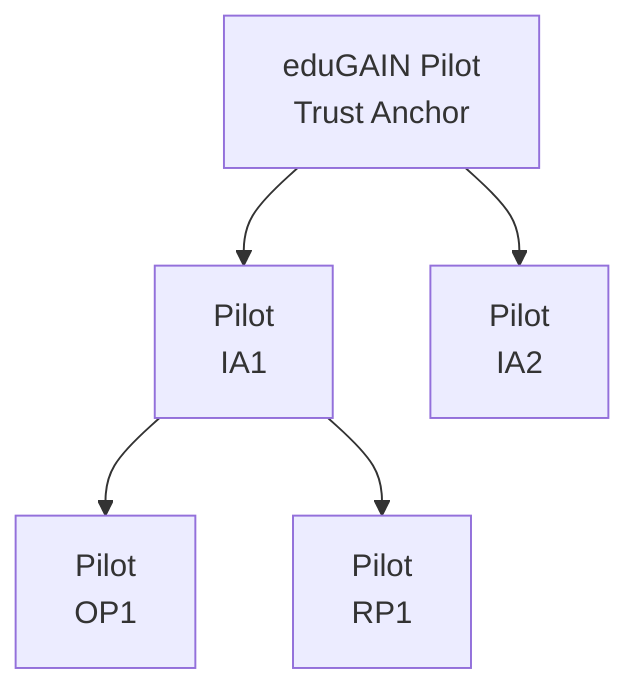

# eduGAIN OpenID Federation Pilot


This repository is dedicated to the eduGAIN OpenID Federation Pilot.

> eduGAIN is the interfederation service that connects identity federations around the world,
> simplifying access to content, services and resources for the global research and education
> community. eduGAIN comprises over 80 participant federations connecting more than 9,000
> Identity and Service Providers.

For more information about eduGAIN please visit:

- General information - eduGAIN main website: https://edugain.org
- Membership, entities, metadata - eduGAIN Tecnical site: https://technical.edugain.org
- Documentation, Meetings, Governance - the eduGAIN wiki: https://wiki.edugain.org

---

## Pilot environment

The pilot environment consists of the following elements:
- https://ta.dev.localhost: the eduGAIN OpenID Federation Pilot Trust Anchor, based on the LightHouse OIDFed Trust Anchor (https://go-oidfed.github.io/lighthouse/).
- https://ia1.dev.localhost: Intermediate Authority 1, which is an entity controlled by the pilot team that acts as a mock federation. It's a subordinate of the eduGAIN-TA based on the LightHouse OIDFed Trust Anchor.
- https://ia2.dev.localhost: Intermediate Authority 2, which is an entity controlled by the pilot team that acts as a mock federation. It's a subordinate of the eduGAIN-TA based on the LightHouse OIDFed Trust Anchor.
- https://rp1.dev.localhost: Relaying Party 1, which is an entity controlled by the pilot team offering a simple OIDFed Relaying Party. It's a subordinate of the Intermediate Authority 1. It's based on OFFA - Openid Federation Forward Auth (https://go-oidfed.github.io/offa/).




> [!NOTE]
> The pilot infrastructure is based on a series of docker instances. All the
> configuration files used to set up the dockers are available in the `pilot` directory
> (keys and running data excluded). 

## Pilot Participation

Pilot participation is reserved to current eduGAIN Participants as listed on the eduGAIN Members page, https://technical.edugain.org/status.
Of course, an eduGAIN Participant can nominate or aknowledge the participation of anyone on its behalf. Here you can find all the technical information needed to set up your own Trust Anchor/Intermediate Authority, in order to submit a pilot participation request please refer to the eduGAIN WIKI [https://wiki.geant.org/display/eduGAIN/eduGAIN+-+Open+ID+Federation+Pilot](https://wiki.geant.org/display/eduGAIN/eduGAIN+-+Open+ID+Federation+Pilot), or ask to [<support@edugain.org>](mailto:support@edugain.org).

### Intermediate Authorities Requirements

In order to participate to the pilot, you should have set up your own OpenID Federation Trust Anchor (TA) that will be registered as a Subordinate Entity to the eduGAIN Trust Anchor. From the eduGAIN point of view, the participant 
Trust Anchor is an Intermediate Authority, which is the main term that will be used in this documentation. 

You are welcome to use whatever software you want to set up your own Trust Anchor provided that is OpenID Federation draft 43 compliant, and respects the requirements listed below. You can also use the same software currently used for the eduGAIN Trust Anchor, LightHouse. Please find set up instructions and example configurations on the pages [https://go-oidfed.github.io/lighthouse/](https://go-oidfed.github.io/lighthouse/)  

> [!IMPORTANT]  
> Please be aware that the current requirements are going to change in the course
> of the pilot as we introduce more functionalities and policy obligations.  

Intermediate Authorities must respect the following requirements:
- act as Trust Anchor for the entities of their federation.
- provide their own Entity Configuration at the `<ENTITY_IDENTIFIER> + /.well-known/openid-federation` endpoint.
- the Entity Configuration contains the following OpenID Federation metadata parameters:
  - `organization_name`: matches the Organization Name already published as eduGAIN Participant.
  - `contacts`: contains the technical email address of the federation.
  - `organization_uri`: contains a URL pointing to the official Organizations' site.
  - `display_name`: contains a human-readable name of the entity to be presented to the end-user.
- sign the Entity Configuration with the key provided to eduGAIN for the verification of authenticity (see Participation requests below). 
- expose the following endpoints:
  - `federation_fetch_endpoint` as described in [https://openid.net/specs/openid-federation-1_0.html#fetch_endpoint].
  - `federation_list_endpoint` as described in [https://openid.net/specs/openid-federation-1_0.html#entity_listing].
  - `federation_resolve_endpoint` as described in [https://openid.net/specs/openid-federation-1_0.html#name-resolve-entity]. The resolve endpoint MUST accept queries with the `trust_anchor` parameter equals to:
    - the Intermediate Authority.
    - the eduGAIN Trust Anchor.
  - list the eduGAIN OIDF Pilot TA --- "https://ta.dev.localhost" --- as one of their Trust Anchor.
 
### eduGAIN Pilot Entities Configurations

Here you can find some example Entity Configurations provided by the current
eduGAIN OpenID Federation Pilot entities.

- eduGAIN OpenID Federation Pilot Trust Anchor - https://ta.dev.localhost

```
{
  "exp": 1752246223.7172408,
  "iat": 1752159823.7172408,
  "iss": "https://ta.dev.localhost",
  "jwks": {
    "keys": [
      {
        "alg": "ES256",
        "crv": "P-256",
        "kid": "xcXdyJ2_7cOd05QIqfpdrb3j5-mYFw8dqdcqzEh0lUw",
        "kty": "EC",
        "use": "sig",
        "x": "hh5u_VrRXLaXNAdZX2CQWNAXFqgDCYhYGY1y1qbx9Q8",
        "y": "qNPeoZOuVv-I6e-oUt9imwV6TSt-ymTaaW2Mrlgo0JQ"
      }
    ]
  },
  "lighthouse_version": "0.5.1",
  "metadata": {
    "federation_entity": {
      "contacts": [
        "support@edugain.org"
      ],
      "display_name": "eduGAIN OIDF Pilot Trust Anchor",
      "federation_enroll_endpoint": "https://ta.dev.localhost/enroll",
      "federation_fetch_endpoint": "https://ta.dev.localhost/fetch",
      "federation_list_endpoint": "https://ta.dev.localhost/list",
      "federation_resolve_endpoint": "https://ta.dev.localhost/resolve",
      "organization_name": "eduGAIN",
      "organization_uri": "https://edugain.org"
    }
  },
  "sub": "https://ta.dev.localhost"
}
```

- Intermediate Authority 2 - https://ia2.dev.localhost

```
{
  "authority_hints": [
    "https://ta.dev.localhost"
  ],
  "exp": 1752246518.9038033,
  "iat": 1752160118.9038033,
  "iss": "https://ia2.dev.localhost",
  "jwks": {
    "keys": [
      {
        "alg": "ES512",
        "crv": "P-521",
        "kid": "V9BIFlN_TB-TTGggWcnRU_APfSjsi1MxwPBhvRz3Now",
        "kty": "EC",
        "use": "sig",
        "x": "AB6kKs3DH3SVNkLwrPHfwP1crdbfpYIyQxqQ5PloZzpGQXFj4fG5pWzYB5UgxanO0MtUHR-NZmKUJ_58ffvgBXNp",
        "y": "AcjpQWBsRJyE6Tf3Bw9Qg9H7eWwCV12zHtnB8T5TovHkud1D1qyjLmeq8rDeOHTielIqCTHZ70ErOrnxqqAWcFn5"
      }
    ]
  },
  "lighthouse_version": "0.5.1",
  "metadata": {
    "federation_entity": {
      "contacts": [
        "support@edugain.org"
      ],
      "display_name": "eduGAIN OIDF Pilot Intermediate Authority 2",
      "federation_enroll_endpoint": "https://ia2.dev.localhost/enroll",
      "federation_fetch_endpoint": "https://ia2.dev.localhost/fetch",
      "federation_list_endpoint": "https://ia2.dev.localhost/list",
      "federation_resolve_endpoint": "https://ia2.dev.localhost/resolve",
      "organization_name": "eduGAIN",
      "organization_uri": "https://edugain.org"
    }
  },
  "sub": "https://ia2.dev.localhost"
}
```

